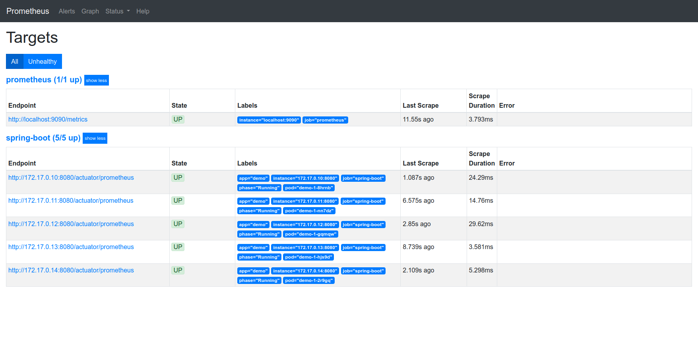

# Service Discovery Demo for Prometheus on okd

## Prerequisites

Default Minishift installation.

## Setup

```bash
$ oc apply -f s2i-java11.yml
$ oc apply -f demo.yml
$ oc apply -f prometheus
$ oc start-build demo --from-dir=demo
```



## Key Ideas

Create a link:prometheus/prometheus.rbac.yml#L1-L4[service account] (`prometheus`) and link:prometheus/prometheus.rbac.yml#L19-L29[bind] a dedicated link:prometheus/prometheus.rbac.yml#L6-L17[role] (e.g. `podview`) which is only allowed to list pods within the project. This service account must be used by the prometheus pod which is configured by the link:prometheus/prometheus.dc.yml#L46[deployment config] variable `spec.template.spec.serviceAccount`.

Since Spring Boots default Prometheus endpoint is http://host:8080/actuator/prometheus add a label to all pods (e.g. `prometheus/job_name`) with a specific value (e.g. `spring-boot`) to simplify link:prometheus/prometheus.cm.yml#L28-L47[configuration] of Prometheus dynamic scrape job(s).


To accept only pods with a Spring Boot label and (default) Prometheus endpoint use relabel
[source,yaml]
----
relabel_configs:
- source_labels: [__meta_kubernetes_pod_label_prometheus_job_name, __meta_kubernetes_pod_container_port_number]
  separator: ':'
  regex: spring-boot:8080 # <1>
  action: keep            # <2>
----
<1> combined (source) labels by separator must match exactly `spring-boot:8080`
<2> configuration is added as target (non matching are rejected)

## Links
* Sebastian Daschner https://blog.sebastian-daschner.com/entries/prometheus-kubernetes-discovery[Prometheus Kubernetes Discovery] Blogpost
* Prometheus https://prometheus.io/docs/prometheus/latest/configuration/configuration/#kubernetes_sd_config[Kubernetes SD Config]
* Prometheus https://prometheus.io/docs/prometheus/latest/configuration/configuration/#relabel_config[Relabel Config]
* Kubernetes https://kubernetes.io/docs/reference/access-authn-authz/rbac/[Using RBAC Authorization]