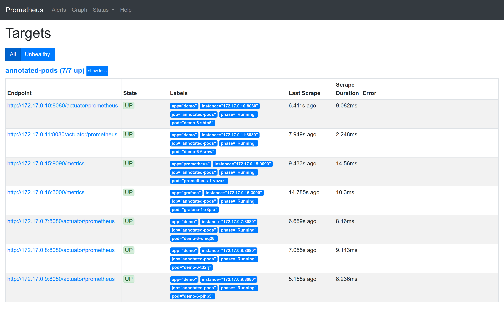

# Service Discovery Demo for Prometheus on okd

## Prerequisites

Default Minishift installation.

## Setup

```bash
$ oc apply -f s2i-java11.yml
$ oc apply -f demo.yml
$ oc apply -f prometheus
$ oc start-build demo --from-dir=demo
```



## Key Ideas

Create a link:prometheus/prometheus.rbac.yml#L1-L4[service account] (`prometheus`) and link:prometheus/prometheus.rbac.yml#L19-L29[bind] a dedicated link:prometheus/prometheus.rbac.yml#L6-L17[role] (e.g. `podview`) which is only allowed to list pods within the project. This service account must be used by the prometheus pod which is configured by the link:prometheus/prometheus.dc.yml#L49[deployment config] variable `spec.template.spec.serviceAccount`.

Pods with a Prometheus metric endpoint can be configured by utilizing Kubernetes annotations such that *one* Prometheus scrape job is sufficient to setup the pod as target (https://github.com/prometheus-operator/kube-prometheus/pull/16#issuecomment-424318647[1], https://gist.github.com/reachlin/a98b90afcbff4604c90c183a0169474f[2]). 

The annotations are used together with Prometheus link:prometheus/prometheus.cm.yml#L28-L47[relabel config] mechanism:

[source,yaml]
----
relabel_configs:
- source_labels: [__meta_kubernetes_pod_annotation_prometheus_io_scrape]              # <1>
  regex: true
  action: keep
- source_labels: [__address__, __meta_kubernetes_pod_annotation_prometheus_io_port]   # <2>
  regex: (.+)(?::\d+);(\d+)
  replacement: $1:$2
  target_label: __address__
- source_labels: [__meta_kubernetes_pod_annotation_prometheus_io_path]                # <3>
  regex: ((?:/[^/ ]+)+)
  target_label: __metrics_path__
- source_labels: [__address__, __meta_kubernetes_pod_annotation_prometheus_io_scheme] # <4>
  regex: https?
  target_label: __scheme__
----
<1> keep only targets annotated w/ `prometheus.io/scrape: "true"`
<2> if `prometheus.io/port: "..."` annotation is present use the given port (otherwise use pods exposed port)
<3> if `prometheus.io/path: ...` is present use the given path (otherwise `/prometheus`)
<4> if one of `prometheus.io/scheme: http|https` is present, use the given scheme (default is `http`)

A deployment configuration for a pod with a common Prometheus enabled Spring Boot application has these link:demo.yml#L61-L64[annotations]:
[source,yaml]
----
template:
  metadata:
    annotations:
      prometheus.io/scrape: "true"
      prometheus.io/path: /actuator/prometheus
      prometheus.io/port: "8080"
----

## Links
* Sebastian Daschner https://blog.sebastian-daschner.com/entries/prometheus-kubernetes-discovery[Prometheus Kubernetes Discovery] Blogpost
* Prometheus https://prometheus.io/docs/prometheus/latest/configuration/configuration/#kubernetes_sd_config[Kubernetes SD Config]
* Prometheus https://prometheus.io/docs/prometheus/latest/configuration/configuration/#relabel_config[Relabel Config]
* Kubernetes https://kubernetes.io/docs/reference/access-authn-authz/rbac/[Using RBAC Authorization]
